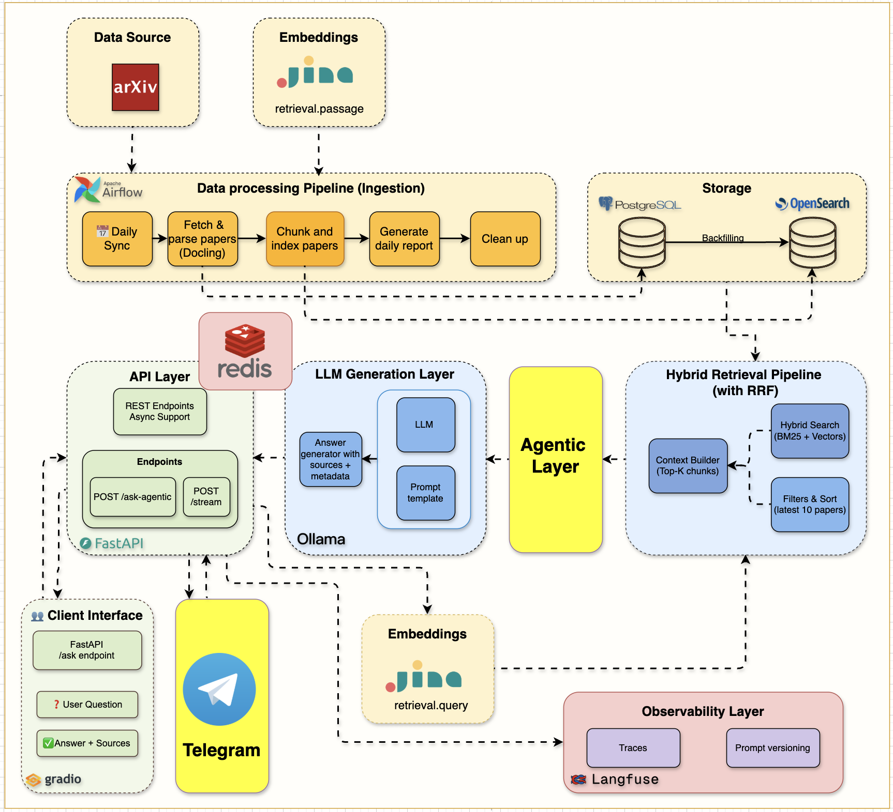
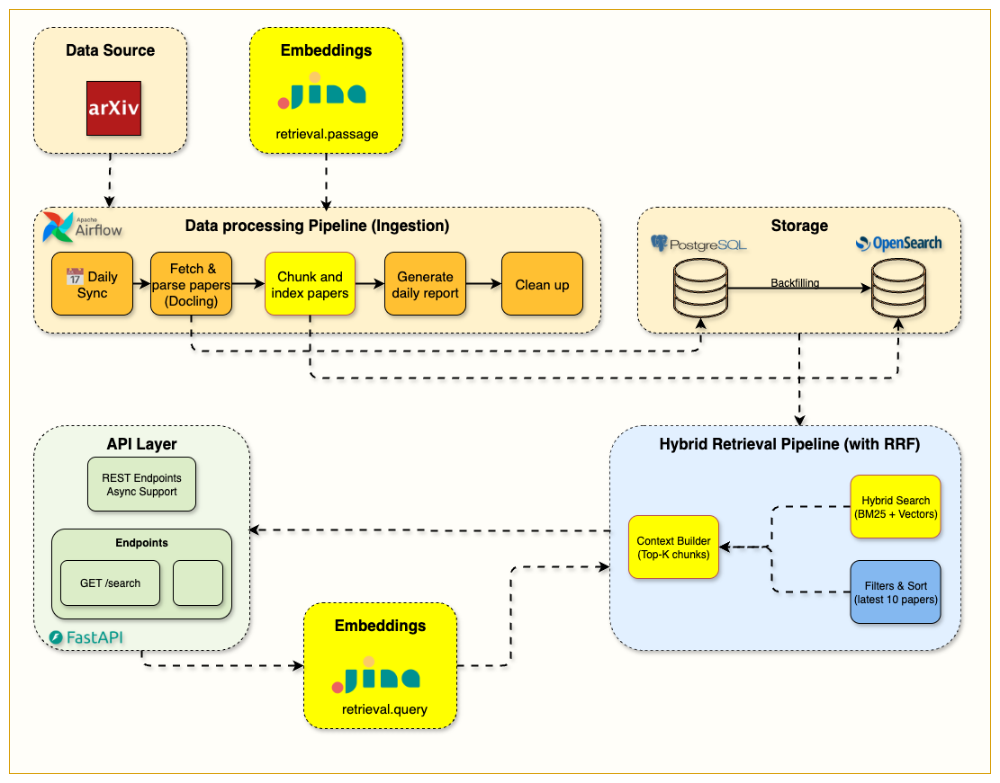
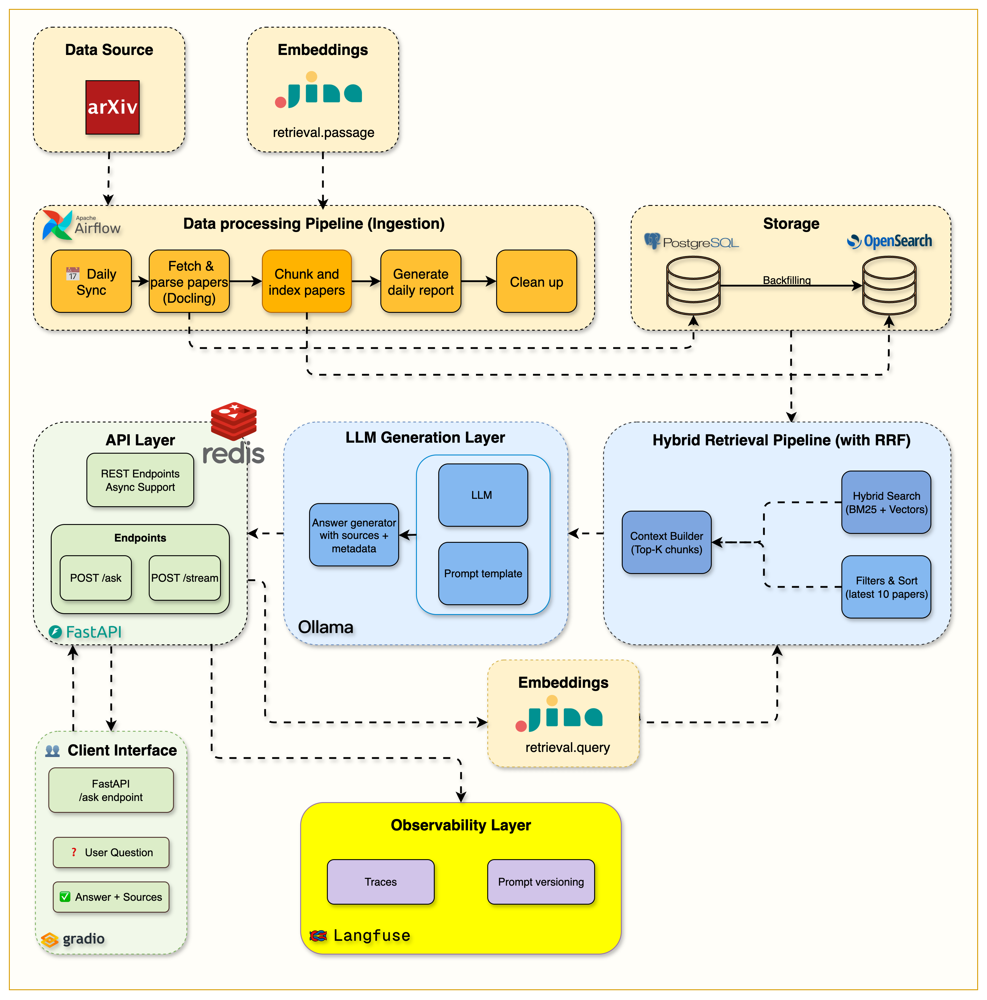

# arXiv Paper Curator

<div align="center">
  <h3>An Agentic RAG System for Academic Research</h3>
  <p>Automatically fetches, indexes, and reasons over academic papers from arXiv using hybrid search and LangGraph-powered agents</p>
</div>

<p align="center">
  
  
  
  
  
</p>

<p align="center">
  
</p>

---

## Overview

**arXiv Paper Curator** is a self-hosted research assistant that continuously ingests academic papers from arXiv, processes them through a hybrid retrieval pipeline, and answers research questions using an agentic RAG system. It combines BM25 keyword search with semantic vector search via Reciprocal Rank Fusion (RRF), then layers a LangGraph agent that grades retrieved documents, rewrites queries when needed, and enforces out-of-domain guardrails.

A Telegram bot provides conversational access from any device.

---

## Features

- **Automated Ingestion** — Apache Airflow DAGs fetch and parse arXiv papers daily, storing metadata in PostgreSQL and full-text chunks in OpenSearch
- **Hybrid Search** — BM25 keyword search fused with Jina AI semantic embeddings via RRF for high-precision retrieval
- **Agentic RAG** — LangGraph-orchestrated agent with document grading, adaptive query rewriting, and hallucination guardrails
- **Local LLM** — Ollama-served models for fully private, offline inference
- **Streaming Responses** — Server-Sent Events (SSE) for real-time answer generation
- **Telegram Bot** — Conversational interface for mobile access with full reasoning transparency
- **Observability** — End-to-end Langfuse tracing with latency, cost, and relevance metrics
- **Redis Caching** — Exact-match semantic caching with up to 400× latency reduction on repeated queries
- **Gradio UI** — Interactive web interface at `localhost:7861`

---

## Architecture

### System Overview
<div align="center">
  
  <p><em>Full system architecture with Telegram bot and agentic RAG pipeline</em></p>
</div>

### LangGraph Agentic RAG Workflow
<div align="center">
  
  <p><em>LangGraph workflow: guardrails → retrieval → document grading → query rewriting → generation</em></p>
</div>


---

## Quick Start

### Prerequisites
- **Docker Desktop** with Docker Compose
- **Python 3.12+**
- **UV** ([installation guide](https://docs.astral.sh/uv/getting-started/installation/))
- **8 GB+ RAM**, **20 GB+ free disk space**

### Setup

```bash
# 1. Clone the repository
git clone <repository-url>
cd arxiv-paper-curator

# 2. Configure environment
cp .env.example .env
# Add your JINA_API_KEY (free tier available) and optionally Langfuse + Telegram keys

# 3. Install Python dependencies
uv sync

# 4. Start all services
docker compose up --build -d

# 5. Verify
curl http://localhost:8000/health
```

### Access Services

| Service | URL | Purpose |
|---------|-----|---------|
| **API Documentation** | http://localhost:8000/docs | Interactive API explorer |
| **Gradio Interface** | http://localhost:7861 | Web chat UI |
| **Langfuse Dashboard** | http://localhost:3000 | Tracing and monitoring |
| **Airflow Dashboard** | http://localhost:8080 | Pipeline management |
| **OpenSearch Dashboards** | http://localhost:5601 | Search engine UI |

> **Note:** Airflow credentials are in `airflow/simple_auth_manager_passwords.json.generated`

---

## Infrastructure Components

<p align="center">
  
</p>

| Component | Port | Purpose |
|-----------|------|---------|
| FastAPI | 8000 | REST API with async support |
| PostgreSQL 16 | 5432 | Paper metadata and content storage |
| OpenSearch 2.19 | 9200 / 5601 | Hybrid search engine + dashboards |
| Apache Airflow 3.0 | 8080 | Ingestion workflow orchestration |
| Ollama | 11434 | Local LLM inference |
| Redis | 6379 | Semantic response caching |
| Langfuse | 3000 | Pipeline tracing and observability |

---

## Data Pipeline

<p align="center">
  
</p>

The pipeline ingests papers from the arXiv API with rate-limiting and retry logic, parses PDFs using Docling, and stores structured metadata in PostgreSQL alongside searchable chunks in OpenSearch.

**Key components:**
- `src/services/arxiv/` — Rate-limited arXiv API client
- `src/services/pdf_parser/` — Docling-powered scientific PDF processing
- `airflow/dags/` — Automated daily ingestion DAGs

---

## Search

<p align="center">
  
</p>

<p align="center">
  
</p>

Search is powered by two complementary strategies fused via RRF:
- **BM25** — Term-frequency keyword search for exact and near-exact matches
- **Semantic** — Jina AI dense embeddings for conceptual similarity

Section-based chunking with overlap preserves document context across both strategies.

**Key components:**
- `src/services/opensearch/` — BM25 and vector search implementation
- `src/services/embeddings/` — Jina AI embedding pipeline with fallback
- `src/services/indexing/` — Section-aware text chunker
- `src/routers/hybrid_search.py` — Unified search API (BM25, semantic, or hybrid)

---

## RAG Pipeline

<p align="center">
  
</p>

Retrieved chunks are assembled into a context window and passed to an Ollama-served LLM. Responses stream via SSE. An optimized system prompt reduces token usage by ~80% versus naive implementations.

**Key components:**
- `src/routers/ask.py` — `/api/v1/ask` (standard) and `/api/v1/stream` (SSE) endpoints
- `src/services/ollama/` — LLM client with prompt management
- `src/gradio_app.py` — Gradio web UI (port 7861)

---

## Observability & Caching

<p align="center">
  
</p>

Every request is traced end-to-end in Langfuse, capturing retrieval latency, token counts, and relevance scores. Redis caches exact-match responses, achieving up to 400× latency reduction on repeated queries.

**Key components:**
- `src/services/langfuse/` — Tracing integration
- `src/services/cache/` — Redis client with graceful fallback

---

## Agentic RAG

The agentic pipeline wraps retrieval in a LangGraph state machine:

1. **Guardrail node** — Rejects out-of-domain queries before retrieval
2. **Retrieval node** — Executes hybrid search
3. **Grading node** — Scores each retrieved document for relevance
4. **Rewrite node** — Reformulates the query if graded documents are insufficient
5. **Generation node** — Produces the final answer with citations

**Key components:**
- `src/services/agents/nodes/` — Individual node implementations
- `src/services/agents/agentic_rag.py` — LangGraph workflow definition
- `src/routers/agentic_ask.py` — `/api/v1/agentic-ask` endpoint
- `src/services/telegram/` — Telegram bot command handlers

---

## Configuration

```bash
cp .env.example .env
```

| Variable | Required | Purpose |
|----------|----------|---------|
| `JINA_API_KEY` | Yes (hybrid search) | Embedding generation via Jina AI |
| `TELEGRAM__BOT_TOKEN` | Yes (Telegram bot) | Telegram bot integration |
| `LANGFUSE__PUBLIC_KEY` | No | Pipeline tracing |
| `LANGFUSE__SECRET_KEY` | No | Pipeline tracing |

See [.env.example](.env.example) for all options with documentation.

---

## Technology Stack

| Component | Technology |
|-----------|------------|
| API | FastAPI 0.115+ |
| Database | PostgreSQL 16 |
| Search Engine | OpenSearch 2.19 |
| Orchestration | Apache Airflow 3.0 |
| Embeddings | Jina AI |
| LLM | Ollama |
| Agent Framework | LangGraph |
| Caching | Redis |
| Observability | Langfuse |
| Dev Tools | UV, Ruff, MyPy, Pytest |

---

## Project Structure

```
arxiv-paper-curator/
├── src/
│   ├── routers/            # API endpoints (search, ask, hybrid-search, agentic-ask)
│   ├── services/           # Business logic
│   │   ├── agents/         # LangGraph agentic RAG (nodes, workflow, prompts)
│   │   ├── opensearch/     # Search service (BM25 + vector)
│   │   ├── ollama/         # LLM client with optimized prompts
│   │   ├── embeddings/     # Jina AI embedding pipeline
│   │   ├── cache/          # Redis caching
│   │   ├── langfuse/       # Observability integration
│   │   ├── telegram/       # Telegram bot handlers
│   │   └── arxiv/          # arXiv API client
│   ├── models/             # SQLAlchemy database models
│   ├── schemas/            # Pydantic validation schemas
│   └── config.py           # Environment configuration
├── airflow/
│   └── dags/               # Ingestion DAG definitions
├── notebooks/              # Exploratory notebooks
├── tests/                  # Unit and integration tests
└── compose.yml             # Docker service orchestration
```

---

## API Reference

| Endpoint | Method | Description |
|----------|--------|-------------|
| `/health` | GET | Service health check |
| `/api/v1/papers` | GET | List stored papers |
| `/api/v1/papers/{id}` | GET | Get a specific paper |
| `/api/v1/search` | POST | BM25 keyword search |
| `/api/v1/hybrid-search/` | POST | Hybrid search (BM25 + semantic) |
| `/api/v1/ask` | POST | RAG-powered Q&A |
| `/api/v1/stream` | POST | Streaming RAG responses (SSE) |
| `/api/v1/agentic-ask` | POST | Agentic RAG with full reasoning trace |

Full interactive docs at http://localhost:8000/docs

---

## Development

```bash
# Start / stop services
make start
make stop

# Code quality
make format        # Ruff formatting
make lint          # Ruff + MyPy

# Tests
make test
make test-cov      # With coverage report

# All available commands
make help
```

Or directly:

```bash
docker compose up --build -d
docker compose ps
docker compose logs [service-name]
docker compose down --volumes   # Full reset
```

---

## Troubleshooting

| Symptom | Resolution |
|---------|------------|
| Services not starting | Wait 2–3 minutes; check `docker compose logs` |
| Port conflicts | Free ports 8000, 8080, 5432, 9200, 5601 |
| Memory errors | Increase Docker Desktop memory to 8 GB+ |
| Full reset | `docker compose down --volumes && docker compose up --build -d` |

---

## Changelog

| Tag | Highlights |
|-----|------------|
| [week1.0](https://github.com/jamwithai/arxiv-paper-curator/releases/tag/week1.0) | FastAPI + PostgreSQL + OpenSearch + Airflow infrastructure |
| [week2.0](https://github.com/jamwithai/arxiv-paper-curator/releases/tag/week2.0) | arXiv ingestion pipeline with PDF parsing via Docling |
| [week3.0](https://github.com/jamwithai/arxiv-paper-curator/releases/tag/week3.0) | BM25 search with OpenSearch indexing and query DSL |
| [week4.0](https://github.com/jamwithai/arxiv-paper-curator/releases/tag/week4.0) | Section-based chunking, Jina embeddings, RRF hybrid search |
| [week5.0](https://github.com/jamwithai/arxiv-paper-curator/releases/tag/week5.0) | Ollama RAG pipeline, SSE streaming, Gradio interface |
| [week6.0](https://github.com/jamwithai/arxiv-paper-curator/releases/tag/week6.0) | Langfuse tracing, Redis caching |
| [week7.0](https://github.com/jamwithai/arxiv-paper-curator/releases/tag/week7.0) | LangGraph agentic RAG, Telegram bot |

To check out a specific release:
```bash
git clone --branch <TAG> https://github.com/jamwithai/arxiv-paper-curator
cd arxiv-paper-curator
uv sync
docker compose up --build -d
```

---

## Star History

[](https://star-history.com/#jamwithai/production-agentic-rag-course&Date)

---

## Authors

Built by [Shirin Khosravi Jam](https://www.linkedin.com/in/shirin-khosravi-jam/) and [Shantanu Ladhwe](https://www.linkedin.com/in/shantanuladhwe/).

Technical write-ups on the [JamWithAI Substack](https://jamwithai.substack.com/).

---

## License

MIT — see [LICENSE](LICENSE) for details.
